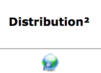
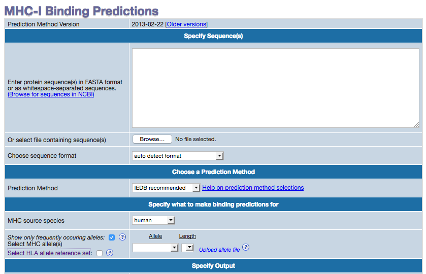
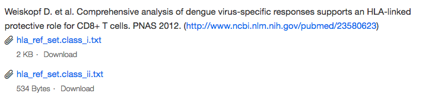

# Lab 5: How the Immune System Detects Mutations

For Lab 5, we will be using the [IEDB Database][1] to predict the binding strength of HLA-A to different peptides. Specifically, we will be using the different p53 sequences from Lab 3 and predict the binding strength of multiple HLA-A alleles to these sequences.

## Part 0: Fundamental Concepts
These questions include fundamental concepts crucial to understanding this lab. Answer the following questions.

### Questions: Fundamental Concepts
1. What is an allele?
2. What are some important roles of HLA-A?
3. What is an MHC Class I molecule?

## Part 1: Understanding HLA-A and its Alleles

For part 1 of this lab, we will research different HLA-A allele frequencies in a specific population of interest.
1. Navigate to [Allele Frequencies][3].
2. We will use this portal to explore HLA-A frequencies. In the sidebar menu, hover above **HLA** and click on **HLA Allele Freq (Classical)**.
![Allele Frequencies][alleleFreqHome]
2. In the resulting search page, under locus, select **locus A**.

3. In the population dropdown menu, select any country or region of interest (e.g. Albania). **Note**: Some countries do not contain information for HLA-A. If you get an error, choose a different country or region.
![population][population]
4. Click **Search**.
5. The resulting search results will tell you the different alleles for HLA-A and their frequencies in that population.

### Questions: Populations and HLA-A Frequencies
1. What is the name of the most frequent allele in the population you chose?
2. Click on the Distribution map of the most frequent allele for your chosen population. This should redirect you to a global map and the locations of your chosen allele.

a. Is this allele geographically concentrated or spread out?

b. In which regions is this allele the most concentrated?

c. Can you think of potential explanations for the distribution of this allele? (e.g. If it is spread out
  around the globe, what could have caused this spread? If it is concentrated in a couple areas, what factors would concentrate this allele?)

1. Click the back arrow to navigate from the map to your search results.
2. Under the column labeled **IMGT/HLA Database**, click "**see**" next to the most frequent allele.

3. On the resulting page, click on the first allele. This will redirect you to a page of information for that allele.

### Question: Most Frequent Allele
1. What is the protein sequence for this allele?

## Part 2: Designing a Reference Allele Set
As we will see in part 2 of this lab, IEDB provides us with a set of reference alleles that cover a large portion of the population.

1. Navigate to [IEDB][1]
2. On the resulting page, in the right sidebar, there is a box labeled **T cell Epitope Prediction**. In this box, click on **MHC I Binding**.

This will redirect you to a new page where you can upload sequences and predict the binding affinity of multiple HLA alleles to that sequence. This
page allows you to predict on self-selected alleles or predicted on a reference set of alleles. First, we will explore a pre-curated reference set of alleles.

1. In the section labeled **Specify what to make binding predictions for**, click on the link labeled **Select HLA allele reference set**.

### Questions: Reference Set Alleles
The resulting page should have information about the reference set. With this information, answer the following questions.
1. What is the reference set?
2. What are the advantages of using a reference set when studying binding affinity of epitopes?
3. In your own words, what criteria are used to decide whether a certain allele is added to a reference set?

4. At the bottom of the page, download the HLA class 1 reference set. In this file, does the most frequent allele you found in your population in part 1 of the lab appear in this list?

# Part 2: Prediction Methods for MHC Class I Molecules
In part 2 of the lab, we will investigate the types of methods used to predict binding affinity of sequences to MHC class I molecules.
1. On the MHC-I Binding Predictions page, click on **Help on prediction method selections** under the section labeled **Choose a Prediction Method**

2. On the resulting page, you will see a description for **Choose a prediction method**. Read the explanation and answer the following questions.

## Questions: Prediction Methods for MHC Class I Molecules
1. How many available prediction methods are there for prediction of MHC Class 1 binding affinity?
2. What is the IEDB recommended method? Give a brief explanation of the method.
3. **Bonus**: Click on any method from the available methods and read the abstract. (If you are feeling explorative, read the whole paper!) Give a brief description of this method.

## Part 3: Prediction of Sequences

For part 3 of the lab, we will take mutated p53 sequences from lab 3 and compare their ability to be recognized by the immune system.

First, to do this, we must predict how the p53 sequences will be chopped up by the proteosome. These chopped peptides will then be transported to the cell membrane by an MHC Class I Molecule.
For a visual demonstration of this process, see [Proteosome Cleavage][6].

To predict where these sequences are chopped, we used **Clipper**, a tool that predicts the cleavage sites of protein sequences by the proteosome. We predict the cleavage of three sequences from lab 3: a template p53 sequence, a sequence with R273H mutation, and another sequence with booth r273c and t284r mutations. To learn more about Clipper, see [Clipper Slideshow][7]. Here is the resulting cleavage pattern of sequence portion with the mutations:

>Mutation?

``---------X----------X------------------``

>p53_normal

``LLGRNSFEVRVCACPGRDRRTEEENLRKKGEPHHELPPG``

``++++--+++++++++-+--------++++---++-+---``

>p53_mutations_r273h

``LLGRNSFEVHVCACPGRDRRTEEENLRKKGEPHHELPPG``

``++++--+-+++++++-+--------++++---++-+---``

>p53_mutations_r273c_t284r

``LLGRNSFEVCVCACPGRDRRREEENLRKKGEPHHELPPG``

``++++-+++++++++-----------++++---++-+---``

Here, the '+' and '-' indicate where the sequences are cleaved and not cleaved, respectively. On the first line, an "X" represents the location of a mutation.

Using these cleaved sequences, answer the following questions.

### Questions: Cleavage of p53 Sequences
1. Look each sequence's cleavage patterns and mutations.
a. Which mutations create the strongest deviation in cleavage pattern?

b. Is there a certain base pair distance between a mutation and the cleavage range it effects?

Now, we will use the cleavage patterns of these sequences to extract epitopes and predict the binding affinity of these sequences to HLA-A.

Epitope       |    Presence in Sequences         
------------- |--------------------------------
VDSTPPPGT       |       All                      
SDSDGLAPPQH     |       All                      
DRRTEEEN        | p53_normal,p53_mutations_r273h
PGRDRRREEEN     | p53_mutations_r273c_t284r      

1. Navigate back to the MHC_I Binding Prediction page: [MHC 1 Binding][5]
3. Under the section called **Specify Sequence(s)**, enter in the epitopes provided in the table above:

2. Under the section called **Specify what to make binding predictions for**, upload your reference allele set downloaded in part 2. **Important**: Before uploading the reference allele set, be sure to open the file, and
remove all HLA-B alleles. Only include HLA-A alleles.

3. Click **Submit**.
4. Wait. This may take a couple minutes...

On the resulting page, you will see a list of epitopes extracted from your input epitopes and a prediction of binding for each allele.

### Questions: Binding Prediction of p53 Epitopes
1. Given the information on this page, what does the percentile rank indicate?
2. For the 	SDSDGLAPPQH epitope, which HLA-A allele has the highest binding affinity? What is the percentile rank for that allele?
3. Compare the binding affinity for epitopes DRRTEEEN and PGRDRRREEEN.
a. Which alleles have the strongest affinity for these sequences?

b. The prefix for epitope PGRDRRREEEN is PGR. This sequence does not exist in DRRTEEEN, due to difference in cleavage patterns. Summarize the differences in binding affinity that results in the addition of this prefix.

<references>
[1]: http://www.iedb.org/ "IEDB"

[2]: http://help.iedb.org/hc/en-us/articles/114094151851 "HLA-A Alleles"

[3]: http://allelefrequencies.net "Allele Frequencies"

[4]: https://github.com/massie/chipper "Clipper"

[5]: http://tools.iedb.org/mhci/ "MHC I Binding"

[6]: https://en.wikipedia.org/wiki/Major_histocompatibility_complex#/media/File:MHC_Class_I_processing.svg "Proteosome Cleavage"

[7]: https://people.eecs.berkeley.edu/~massie/slides/vhse/#/ "Clipper Slideshow"

<Images>
[alleleFreqHome]: ../images/lab5/alleleFreqHome.png "Allele Frequencies Home"
[locusA]: ../images/lab5/locus.png "Locus A"
[population]: ../images/lab5/population.png "Population"
[distribution]: ../images/lab5/distribution.png "Distribution"
[imgtDB]: ../images/lab5/imgtDB.png "IMGT Database"
